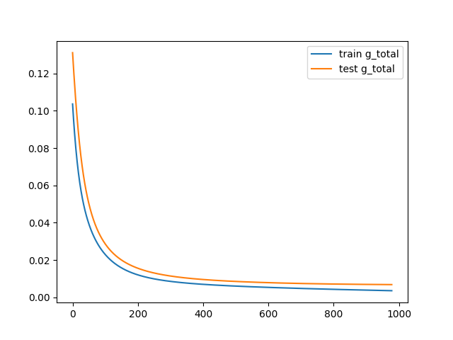
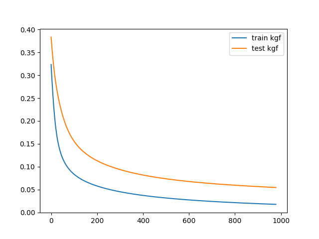
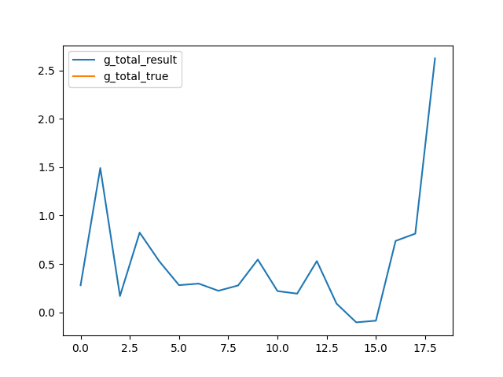
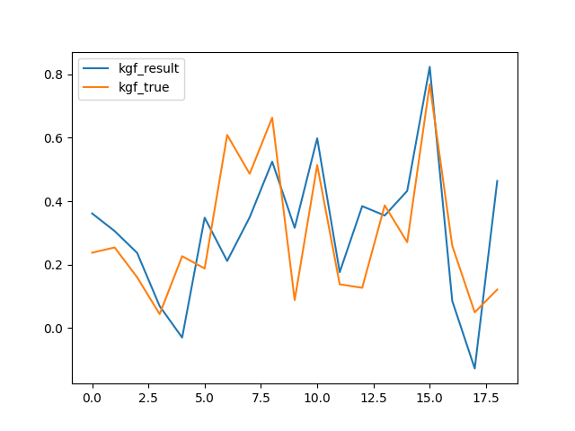

# NeuralNetworksLab2
По выбранным параметрам из задания 1 и по датасету ID_data_mass_18122012 построен трехслойный перцептрон (2 скрытых слоя). 
Обучение - обратное распространение ошибки. Выходной слой - 2 нейрона (сигмоида).

Dataset из первой лабы в файле withCorel.csv
80% dataset идет на обучение, оставшиеся 20% на тестирование
Код программы в файле main.py

**Количество эпох** - 1000
**Коэффициент обучения** - 0.02

первый слой 19 нейронов
второй слой 80 нейронов
третий слой 60 нейронов
четвертый слой 2 нейрона

**Mean Squared Error (MSE)** - измеряет среднюю сумму квадратной разности между фактическим значением и прогнозируемым значением для всех точек данных. 

Получен график изменения MSE у G_total при тренировке - "синий цвет", при тестовых данных - "оранжевый цвет" в результате смены эпох (1000 эпох) и коэффициентом обучения 0.02:

Получен график измененения MSE у КГФ при тренировке - "синий цвет", при тестовых данных - "оранжевый цвет" в результате смены эпох (1000 эпох) и коэффициентом обучения 0.02:

График соответствия предсказанных значений G_total нейронной сетью реальным значениям из dataset:

График соответствия предсказанных значений КГФ нейронной сетью реальным значениям из dataset:

MSE во время тренировки для G_total и КГФ:\
train mse: [0.14844614 0.45631024]\
train mse: [0.10671582 0.33316822]\
train mse: [0.08172131 0.24765496]\
train mse: [0.06527625 0.19045636]\
train mse: [0.05401071 0.15590242]\
train mse: [0.04593374 0.13436846]\
train mse: [0.03985075 0.11971959]\
train mse: [0.03508499 0.10898374]\
train mse: [0.03124244 0.10069075]\
train mse: [0.02807927 0.09403631]\
train mse: [0.0254351  0.08853872]\
train mse: [0.02319873 0.08388984]\
train mse: [0.02128972 0.07988294]\
train mse: [0.01964781 0.07637417]\
train mse: [0.01822661 0.07326045]\
train mse: [0.01698964 0.07046609]\
train mse: [0.01590769 0.06793432]\
train mse: [0.01495707 0.0656218 ]\
train mse: [0.01411833 0.06349489]\
train mse: [0.01337537 0.0615271 ]\
train mse: [0.01271476 0.05969727]\
train mse: [0.01212523 0.05798829]\
train mse: [0.01159725 0.05638615]\
train mse: [0.01112275 0.05487925]\
train mse: [0.01069486 0.05345787]\
train mse: [0.01030768 0.05211377]\
train mse: [0.00995618 0.05083993]\
train mse: [0.009636   0.04963026]\
train mse: [0.00934341 0.04847949]\
train mse: [0.00907515 0.04738296]\
train mse: [0.00882841 0.04633658]\
train mse: [0.00860074 0.04533667]\
train mse: [0.00839002 0.04437998]\
train mse: [0.00819437 0.04346356]\
train mse: [0.00801217 0.04258472]\
train mse: [0.00784199 0.04174106]\
train mse: [0.00768257 0.04093035]\
train mse: [0.00753281 0.04015059]\
train mse: [0.00739173 0.03939991]\
train mse: [0.00725848 0.0386766 ]\
train mse: [0.00713229 0.0379791 ]\
train mse: [0.00701248 0.03730595]\
train mse: [0.00689847 0.0366558 ]\
train mse: [0.00678972 0.03602742]\
train mse: [0.00668576 0.03541964]\
train mse: [0.00658617 0.0348314 ]\
train mse: [0.00649057 0.03426168]\
train mse: [0.00639862 0.03370956]\
train mse: [0.00631002 0.03317417]\
train mse: [0.00622451 0.0326547 ]\
train mse: [0.00614184 0.0321504 ]\
train mse: [0.00606179 0.03166054]\
train mse: [0.00598417 0.03118448]\
train mse: [0.0059088  0.03072158]\
train mse: [0.00583551 0.03027126]\
train mse: [0.00576417 0.02983298]\
train mse: [0.00569464 0.02940622]\
train mse: [0.00562681 0.02899049]\
train mse: [0.00556056 0.02858535]\
train mse: [0.0054958  0.02819035]\
train mse: [0.00543244 0.0278051 ]\
train mse: [0.00537039 0.02742921]\
train mse: [0.00530959 0.02706232]\
train mse: [0.00524996 0.0267041 ]\
train mse: [0.00519144 0.0263542 ]\
train mse: [0.00513397 0.02601234]\
train mse: [0.0050775  0.02567822]\
train mse: [0.00502198 0.02535157]\
train mse: [0.00496738 0.02503212]\
train mse: [0.00491363 0.02471962]\
train mse: [0.00486072 0.02441385]\
train mse: [0.0048086  0.02411457]\
train mse: [0.00475724 0.02382158]\
train mse: [0.00470661 0.02353467]\
train mse: [0.00465668 0.02325364]\
train mse: [0.00460743 0.02297831]\
train mse: [0.00455883 0.0227085 ]\
train mse: [0.00451087 0.02244405]\
train mse: [0.00446351 0.0221848 ]\
train mse: [0.00441675 0.02193058]\
train mse: [0.00437055 0.02168126]\
train mse: [0.00432492 0.02143669]\
train mse: [0.00427982 0.02119673]\
train mse: [0.00423525 0.02096126]\
train mse: [0.00419119 0.02073015]\
train mse: [0.00414762 0.02050328]\
train mse: [0.00410455 0.02028054]\
train mse: [0.00406194 0.02006182]\
train mse: [0.00401981 0.019847  ]\
train mse: [0.00397812 0.019636  ]\
train mse: [0.00393688 0.0194287 ]\
train mse: [0.00389608 0.01922502]\
train mse: [0.00385571 0.01902486]\
train mse: [0.00381575 0.01882814]\
train mse: [0.00377621 0.01863478]\
train mse: [0.00373707 0.01844468]\
train mse: [0.00369833 0.01825778]\
train mse: [0.00365998 0.018074  ]\
train mse: [0.00362202 0.01789325]\

Итоговое mse тестовых данных по завершению всех эпох для G_total и КГФ:
Test data mse:
	G_total: 0.006859059069146812
	KGF: 0.05455028272586569
